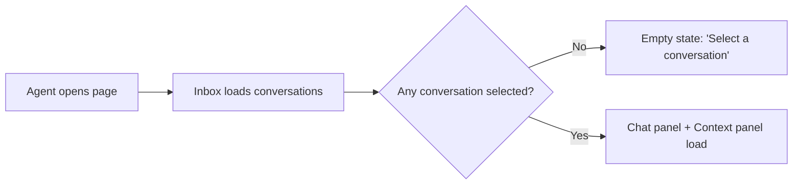
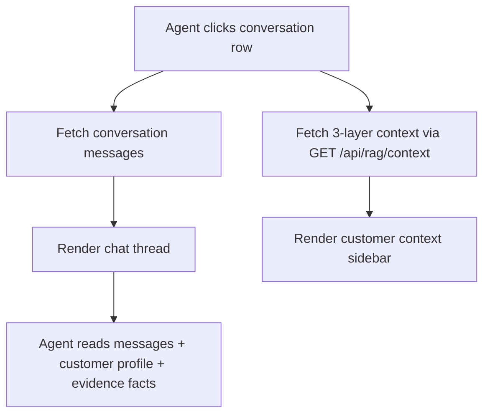
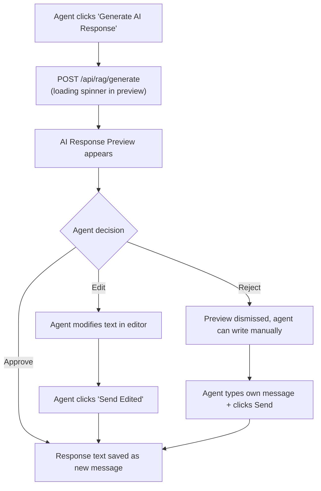
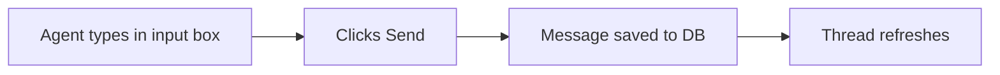

# Minimal Management UI — Implementation Plan (Phase 1, Part 2)

> Build the first usable interface for the VIP Customer Routing platform.
> The existing RAG pipeline ([`src/services/rag/`](file:///c:/University/Study/Programming/Web_React/ecommerce_integrate/src/services/rag)) provides two API endpoints — this UI wires them together into an agent-facing workspace.

---

## 1. Problem & Goal

The RAG pipeline is fully functional via cURL, but there is **no UI** — [`page.tsx`](file:///c:/University/Study/Programming/Web_React/ecommerce_integrate/src/app/page.tsx) is still the default Next.js boilerplate. This plan delivers a **3-panel agent workspace** where a human customer-care agent can:

1. Browse a conversation inbox
2. View a chat thread with full customer context
3. Request AI-generated responses, review grounding annotations, and Approve / Edit / Reject before sending

---

## 2. User Flows

### Flow A: Browse & Select Conversation



### Flow B: Read Conversation & Customer Intel



### Flow C: AI-Assisted Response (Core Loop)



### Flow D: Manual Message (No AI)



---

## 3. State Architecture (Jotai Atoms)

### 3.1 State That Persists Across Navigation (Jotai — global)

| Atom | Type | Purpose | Persisted? |
|:-----|:-----|:--------|:-----------|
| `selectedConversationIdAtom` | `number \| null` | Which conversation is active | ✅ `sessionStorage` — survives page refresh within session |
| `inboxFiltersAtom` | `{ statusFilter, priorityFilter, searchQuery }` | Current inbox filter/search state | ✅ `sessionStorage` |
| `sidebarCollapsedAtom` | `boolean` | Whether context panel is collapsed | ✅ `localStorage` — user preference |

### 3.2 State That Resets When User Navigates Away (React local / derived)

| State | Scope | Lifecycle |
|:------|:------|:----------|
| `aiDraftResponse` | Local to AI Preview component | Cleared when switching conversations |
| `editedResponseText` | Local to Edit mode component | Cleared on send/reject |
| `messageInputText` | Local to input box component | Cleared on send |
| `isGenerating` | Local loading flag | Cleared when API returns |
| `isEditing` | Local boolean | Cleared on send/cancel |

### 3.3 Server State (TanStack Query cache)

| Query Key | Endpoint | Stale Time | Notes |
|:----------|:---------|:-----------|:------|
| `['conversations']` | New Server Action: `getInboxConversations()` | 30s | Inbox list |
| `['conversation', id]` | Server Action: `getConversationById(id)` | 10s | Messages for active chat |
| `['context', id]` | `GET /api/rag/context?conversationId=id` | 60s | 3-layer context (expensive DB query) |
| `['rag-generate', id]` | `POST /api/rag/generate` | ∞ (manual) | Only triggered by button click, never auto-refetches |

### 3.4 What Happens When User Leaves / Returns

| Scenario | Behavior |
|:---------|:---------|
| **Refresh page (F5)** | `selectedConversationIdAtom` restored from `sessionStorage` → same conversation reopens. TanStack Query cache is lost → data re-fetches automatically. AI draft is lost (intentional — stale AI drafts are dangerous). |
| **Switch to different conversation** | Previous AI draft is discarded. Message input is cleared. Context panel loads new customer. Chat scrolls to bottom. |
| **Close browser tab** | `sessionStorage` is cleared. `localStorage` (sidebar preference) survives. Next visit starts fresh. |
| **Idle on page** | TanStack Query background refetch keeps inbox list fresh (30s interval). Active conversation refetches at 10s. |

---

## 4. Component Architecture

```
src/
├── app/
│   ├── page.tsx                          ← [MODIFY] Replace boilerplate → <AgentWorkspace />
│   ├── layout.tsx                        ← [MODIFY] Add JotaiProvider + QueryClientProvider
│   └── globals.css                       ← [MODIFY] Add dark theme tokens + layout vars
│
├── components/                           ← [NEW] All new component files
│   ├── providers/
│   │   └── AppProviders.tsx              ← JotaiProvider + QueryClientProvider wrapper
│   │
│   ├── workspace/
│   │   └── AgentWorkspace.tsx            ← 3-panel layout orchestrator (Client Component)
│   │
│   ├── inbox/
│   │   ├── ConversationInbox.tsx         ← Left panel: conversation list + search
│   │   ├── ConversationRow.tsx           ← Single row: avatar, preview, badge, timestamp
│   │   └── InboxFilters.tsx             ← Status/priority filter pills
│   │
│   ├── chat/
│   │   ├── ChatPanel.tsx                 ← Center panel: message thread + input
│   │   ├── MessageBubble.tsx            ← Single message with sender indicator
│   │   ├── MessageInput.tsx             ← Text input + Send button
│   │   └── EmptyChat.tsx                ← "Select a conversation" placeholder
│   │
│   ├── context/
│   │   ├── CustomerContextPanel.tsx     ← Right panel: 3-layer context display
│   │   ├── VipTierBadge.tsx             ← Color-coded tier badge (Platinum/Gold/Silver/Standard)
│   │   ├── OrderSummaryCard.tsx         ← Linked order with status timeline
│   │   └── EvidenceFactList.tsx         ← Evidence facts with confidence bars
│   │
│   └── copilot/
│       ├── AiResponsePreview.tsx        ← AI response card with grounding annotations
│       ├── GroundingAnnotation.tsx       ← Individual fact citation chip
│       └── CopilotActions.tsx           ← Approve / Edit / Reject buttons
│
├── atoms/                                ← [NEW] Jotai state atoms
│   └── workspaceAtoms.ts
│
├── hooks/                                ← [NEW] Data fetching hooks
│   ├── useConversations.ts              ← TanStack Query: inbox list
│   ├── useConversationDetail.ts         ← TanStack Query: single conversation
│   ├── useCustomerContext.ts            ← TanStack Query: 3-layer context
│   └── useRagGenerate.ts               ← TanStack Query mutation: AI generation
│
├── actions/                              ← [NEW] Server Actions
│   └── conversationActions.ts           ← getInboxConversations, sendMessage, saveAiResponse
│
└── services/                             ← [MODIFY] Add inbox-specific query
    └── conversationService.ts           ← Add getInboxConversations()
```

---

## 5. Proposed Changes

### Dependencies

#### [MODIFY] [`package.json`](file:///c:/University/Study/Programming/Web_React/ecommerce_integrate/package.json)

Add required client-side libraries:

```diff
  "dependencies": {
+   "@tanstack/react-query": "^5",
+   "jotai": "^2",
    "@google/genai": "^2.17.1",
    ...
  }
```

> [!NOTE]
> No additional UI library (no shadcn, no Radix). All components are custom-built with Tailwind CSS + `cn()` utility per project styling conventions.

---

### Providers & Layout

#### [NEW] `src/lib/cn.ts`

Tailwind class merge utility using `clsx` + `tailwind-merge` (or manual implementation to avoid extra deps).

#### [NEW] `src/components/providers/AppProviders.tsx`

Client Component wrapping `QueryClientProvider` + Jotai `Provider`.

#### [MODIFY] [`src/app/layout.tsx`](file:///c:/University/Study/Programming/Web_React/ecommerce_integrate/src/app/layout.tsx)

- Wrap `{children}` in `<AppProviders>`
- Update `<html>` to force dark mode class
- Update metadata title to "VIP Agent Workspace"

#### [MODIFY] [`src/app/globals.css`](file:///c:/University/Study/Programming/Web_React/ecommerce_integrate/src/app/globals.css)

Add design tokens:

```css
:root {
  --sidebar-width: 320px;
  --context-width: 360px;
  --accent-platinum: #c084fc;
  --accent-gold: #fbbf24;
  --accent-silver: #94a3b8;
  --accent-standard: #6b7280;
  --surface-primary: #0f172a;
  --surface-secondary: #1e293b;
  --surface-tertiary: #334155;
  --border-subtle: #334155;
}
```

---

### Data Layer

#### [MODIFY] [`src/services/conversationService.ts`](file:///c:/University/Study/Programming/Web_React/ecommerce_integrate/src/services/conversationService.ts)

Add new function for the inbox:

```typescript
/** Fetch paginated inbox conversations with preview */
export async function getInboxConversations(filters?: {
  statusCode?: string;
  priorityFilter?: string;
  searchQuery?: string;
}): Promise<ConversationWithMessages[]>
```

#### [NEW] `src/actions/conversationActions.ts`

Server Actions:

```typescript
'use server'
export async function fetchInboxAction(filters?: InboxFilters)
export async function sendMessageAction(conversationId: number, text: string)
export async function saveAiResponseAction(conversationId: number, response: RagResponse, wasEdited: boolean)
```

#### [NEW] `src/hooks/useConversations.ts`, `useConversationDetail.ts`, `useCustomerContext.ts`, `useRagGenerate.ts`

TanStack Query hooks wrapping the Server Actions and API routes.

---

### UI Components

#### [MODIFY] [`src/app/page.tsx`](file:///c:/University/Study/Programming/Web_React/ecommerce_integrate/src/app/page.tsx)

Replace entire content with:

```tsx
import { AgentWorkspace } from '@/components/workspace/AgentWorkspace';

export default function Home() {
  return <AgentWorkspace />;
}
```

#### [NEW] `src/components/workspace/AgentWorkspace.tsx`

3-column CSS Grid layout:

```
┌─────────────┬────────────────────────┬──────────────┐
│   INBOX     │       CHAT PANEL       │   CONTEXT    │
│  (320px)    │       (flex-1)         │   (360px)    │
│             │                        │              │
│ Search bar  │  Message bubbles       │ VIP Badge    │
│ Filter pills│  ↕ scrollable          │ Metrics      │
│             │                        │ Order card   │
│ Conv rows   │  ┌──────────────────┐  │ Evidence     │
│ (scrollable)│  │ AI Response      │  │ facts list   │
│             │  │ Preview card     │  │              │
│             │  │ [Approve][Edit]  │  │              │
│             │  │ [Reject]         │  │              │
│             │  └──────────────────┘  │              │
│             │                        │              │
│             │  ┌──────────────────┐  │              │
│             │  │ Message input    │  │              │
│             │  │ [Send] [AI ✨]   │  │              │
│             │  └──────────────────┘  │              │
└─────────────┴────────────────────────┴──────────────┘
```

#### [NEW] Inbox Components

- `ConversationInbox.tsx` — Fetches inbox via `useConversations()`. Maps to `<ConversationRow>`.
- `ConversationRow.tsx` — Displays customer name, last message preview (truncated), intent pill, priority dot, timestamp. Active row highlighted.
- `InboxFilters.tsx` — Clickable filter pills: All / Open / Escalated / Resolved. Priority dropdown.

#### [NEW] Chat Components

- `ChatPanel.tsx` — Scrollable message list. Auto-scrolls on new messages. Contains `<MessageInput>` and conditional `<AiResponsePreview>`.
- `MessageBubble.tsx` — Aligned left (customer) or right (agent/AI). Shows sender label, timestamp, message type icon.
- `MessageInput.tsx` — Textarea + Send button + "Generate AI ✨" button.
- `EmptyChat.tsx` — Illustration + "Select a conversation to start" text.

#### [NEW] Context Panel Components

- `CustomerContextPanel.tsx` — Reads from `useCustomerContext(conversationId)`. Renders VIP badge, metrics grid, order card, evidence list.
- `VipTierBadge.tsx` — Color-coded badge: Platinum (purple), Gold (amber), Silver (slate), Standard (gray).
- `OrderSummaryCard.tsx` — Current order status with mini-timeline of status transitions.
- `EvidenceFactList.tsx` — Each fact with confidence bar (visual percentage), timestamp.

#### [NEW] Copilot Components

- `AiResponsePreview.tsx` — Card showing `responseText`, grounding annotations, confidence meter, `suggestedAction` badge. Contains `<CopilotActions>`.
- `GroundingAnnotation.tsx` — Inline chip showing which evidence fact was cited. Green = grounded, red = ungrounded.
- `CopilotActions.tsx` — Three buttons: ✅ Approve (green), ✏️ Edit (blue), ❌ Reject (red). Edit opens inline textarea.

---

## 6. AI Design Prompt

Use this prompt with an image generation AI (Midjourney, DALL·E, Figma AI, etc.) to generate a reference design mockup:

```
Design a premium dark-mode 3-column agent dashboard for an e-commerce customer service platform.

LAYOUT:
- Left panel (320px): Conversation inbox with search bar at top, scrollable list of conversation rows. Each row shows: customer avatar circle, customer name, last message preview (1 line, truncated), small colored intent pill (e.g., "Refund", "Delivery"), priority dot (green/yellow/red), timestamp. Active row has subtle purple left border highlight and lighter background.
- Center panel (flexible width): Chat message thread with speech bubbles. Customer messages aligned left with light gray background. Agent messages aligned right with indigo/purple background. Each bubble has sender label, timestamp, message type icon. Below the thread: a text input area with a "Send" button and a glowing "✨ Generate AI" button. Above the input, show an optional AI response preview card with a frosted glass effect.
- Right panel (360px): Customer intelligence sidebar. At top: large VIP tier badge (purple for Platinum, amber for Gold, slate for Silver). Below: metrics grid showing Total Spend, Order Count, Avg Order Value, Days Since Last Order in small stat cards. Then: linked order card with status timeline (dots connected by line). Then: evidence facts list, each with a thin confidence progress bar.

STYLE:
- Background: deep navy (#0f172a) with slightly lighter card surfaces (#1e293b)
- Borders: subtle slate (#334155)
- Accent: purple gradient for VIP elements, indigo for interactive elements
- Typography: Inter or Geist Sans, clean and modern
- Cards: subtle rounded corners (8-12px), thin 1px borders, no heavy shadows
- Micro-animations implied: hover states on rows, button press effects
- The AI response preview card should have a subtle gradient border (purple to indigo) to distinguish it from regular messages
- Grounding annotations should appear as small pills inside the AI preview: green pills for grounded facts, red pills for ungrounded claims
- Overall aesthetic: similar to Linear, Vercel Dashboard, or Raycast — minimal, functional, premium dark mode
```

---

## 7. Verification Plan

### Automated Tests

```bash
# Build check — ensure no TypeScript errors
npm run build

# Lint check
npm run lint
```

### Manual Verification

1. **Inbox loads** — conversations render with correct preview, intent, priority
2. **Conversation selection** — clicking a row loads the chat thread and context panel
3. **Context panel** — VIP tier badge matches DB, order card shows correct status, evidence facts display
4. **AI generation** — clicking "Generate AI ✨" calls the API and shows the preview card with grounding annotations
5. **Approve flow** — approved response appears as a new agent message in the thread
6. **Edit flow** — agent can modify the AI text and send the edited version
7. **Reject flow** — preview is dismissed, agent can type a manual message
8. **State persistence** — refresh the page → same conversation is selected. Switch tabs → sidebar preference survives.
9. **Empty states** — no conversation selected shows placeholder. No messages shows "Start the conversation".

---

## Open Questions

> [!IMPORTANT]
> **Q1: Responsive / Mobile support scope?**
> The plan document says "desktop-first". Should we add a mobile-responsive hamburger layout, or strictly desktop-only for Phase 1?

> [!IMPORTANT]
> **Q2: Real-time updates or polling?**
> Should new messages appear in real-time (WebSocket/SSE), or is TanStack Query polling (every 10s) sufficient for Phase 1? Real-time adds significant complexity.

> [!IMPORTANT]
> **Q3: Message persistence on Approve/Send?**
> When the agent approves an AI response, should we:
> - (A) Insert a new `Message` row in the DB with `senderType = 'agent_*'` and store the grounding metadata (`groundedFacts`, `confidence`, `suggestedAction`)
> - (B) Just display it client-side for now (Phase 1 demo) and defer DB persistence to Phase 3
>
> Option A is recommended since the `Message` model already has `groundedFacts`, `ungroundedClaims`, `confidence`, and `suggestedAction` fields.

> [!NOTE]
> **Q4: Should the "Generate AI" button auto-trigger when opening a conversation, or only on manual click?**
> Manual click is recommended to control API costs and avoid surprising the agent with auto-generated responses.
